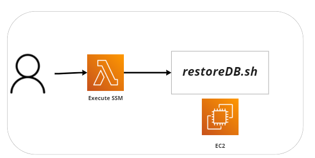

# lambda-ssm-ec2
Lambda that executes Shell Script inside EC2 using [AWS Systems Manager Run Command](https://docs.aws.amazon.com/systems-manager/latest/userguide/execute-remote-commands.html).

# Diagram


# Env Variables
```
INSTANCE_NAME  =  The ID of the managed node where the command should run
SNS_ROLE       =  The ARN of the service role to use Amazon SNS notifications for Run Command commands.
SNS_ARN        =  An Amazon Resource Name (ARN) for an Amazon Simple Notification Service (Amazon SNS) topic.       
BUCKET_NAME    =  The name of the S3 bucket where command execution responses should be stored.
```

# References
- boto3 SSM Send Command: https://boto3.amazonaws.com/v1/documentation/api/latest/reference/services/ssm.html#SSM.Client.send_command
